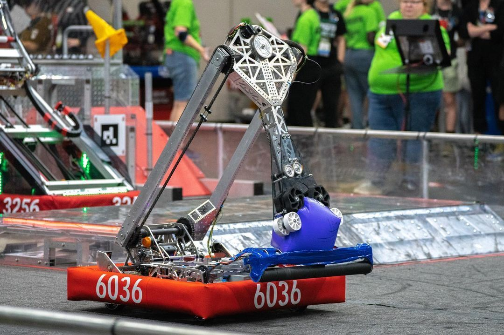

# FRC-2023-Public

This repository contains the code for FRC Team 6036's 2023 Robot: Dum-E

## Features
- [Double-jointed arm trajectory optimization](./arm-opt)
- [Arm dynamics calculation](./src/main/java/com/peninsula/frc2023/util/peninsulaCoolios/kinematics/TwoDOFTorques.java)
- [Full-field AprilTag localization](./src/main/java/com/peninsula/frc2023/robot/RobotStateEstimator.java)
- [Full Shelf Driving (FSD)](./src/main/java/com/peninsula/frc2023/subsystems/controllers/drive/FSDController.java) for [autonomous scoring](./src/main/java/com/peninsula/frc2023/robot/Control.java#L97)
- [27-key macro pad for scoring node selection](./src/main/java/com/peninsula/frc2023/util/MacroPad.java)
- [Flat side](./src/main/java/com/peninsula/frc2023/auto/drive/withoutClimb/ThreePieceFlatAuto.java) and [cable side](./src/main/java/com/peninsula/frc2023/auto/drive/withoutClimb/ThreePieceChargeCableAuto.java) 3 game piece autos
- [Charge station auto balance](./src/main/java/com/peninsula/frc2023/subsystems/controllers/drive/BalanceController.java)
- [Precise gravity constants](./src/main/java/com/peninsula/frc2023/util/peninsulaCoolios/kinematics/TwoDOFTorques.java#L76)
